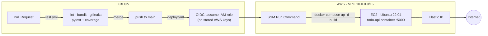

# AWS Terraform CI/CD Pipeline

[](https://github.com/MuhammadMarmash/aws-terraform-cicd-pipeline/actions/workflows/test.yml)
[](https://github.com/MuhammadMarmash/aws-terraform-cicd-pipeline/actions/workflows/deploy.yml)
[](https://www.terraform.io/)
[](https://aws.amazon.com/)
[](https://www.docker.com/)

A Flask REST API deployed to AWS by a fully automated, **keyless** CI/CD pipeline:
Terraform provisions the infrastructure, GitHub Actions tests every pull request, and
every merge to `main` ships to a running EC2 instance with **no SSH keys and no
long-lived AWS credentials anywhere in the loop**.

## Architecture



No inbound SSH anywhere — the security group has no port 22 rule at all. Deploys reach
the instance through **AWS Systems Manager**, not a network path an attacker could probe.
Full topology, module layout, and remote-state details are in
[`terraform/README.md`](terraform/README.md).

## Tech stack

- **Infrastructure & IaC:** Terraform (VPC / security group / EC2 modules) · AWS (EC2,
  VPC, IAM, S3 remote state, Elastic IP, Systems Manager)
- **CI/CD:** GitHub Actions · OIDC federated auth (keyless) · SSM Run Command deploy ·
  automatic semantic version tagging
- **Application:** Python 3.11 · Flask · Gunicorn
- **Containerization:** Docker · Docker Compose
- **Quality & security gates:** pytest + coverage · flake8 · bandit · gitleaks

## Key features

- **Keyless CI/CD** — GitHub Actions assumes an IAM role via OIDC and deploys through
  SSM Run Command. No AWS access keys in secrets, no open SSH port.
- **Version tags that mean something** — the deploy workflow bumps a semantic version
  tag only when application code actually changed (path-filtered), not on every merge.
- **Elastic IP decouples the app from the instance** — `user_data` changes force an
  instance replacement, but the EIP re-attaches automatically, so the CI's `EC2_HOST`
  secret never needs updating.
- **Multi-environment Terraform** — dev/staging/prod via workspaces and one `.tfvars`
  per environment, fully isolated (separate VPCs, instances, EIPs), zero code
  duplication.
- **A real quality gate before merge** — flake8, bandit, gitleaks secret scanning, and
  pytest with coverage all run on every pull request, not just at deploy time.
- **Encrypted, locked remote state** — S3 backend with native (`use_lockfile`) state
  locking, versioning, and a public-access block.

## Getting started

**Run the API locally:**

```bash
git clone https://github.com/MuhammadMarmash/aws-terraform-cicd-pipeline.git
cd aws-terraform-cicd-pipeline
docker compose up --build
# visit http://localhost:5000
```

**Provision the AWS infrastructure:**

```bash
cd terraform
cp terraform.tfvars.example terraform.tfvars   # set project_name, environment
terraform init
terraform apply
```

Needs Terraform ≥ 1.10, an AWS CLI already configured, and an S3 bucket for remote
state — see [`terraform/README.md`](terraform/README.md) for the one-time bucket
bootstrap and the full variable reference.

## Lessons learned / challenges overcome

- **From SSH keys to keyless deploy.** The deploy workflow originally SSH'd in with a
  stored private key. Replaced with GitHub OIDC assuming an IAM role plus SSM Run
  Command — no long-lived AWS credentials in GitHub Secrets, and port 22 closed
  entirely.
- **A `templatefile()` escaping gotcha.** `user_data.sh.tftpl` mixes Terraform
  interpolation (`${repo_url}`) with literal bash parameter expansion (`${APP_HOME}`).
  Terraform tries to interpolate both, so the bash-native `${...}` had to be escaped as
  `$${...}` — a plain comment referencing a shell variable was enough to silently break
  the render.
- **Containerized the deploy.** Moved from a bare `pip install` + `gunicorn` process on
  the host to Docker Compose — `user_data` now only needs Docker and `git`, and a
  deploy is one `docker compose up -d --build` instead of an in-place dependency
  install that could drift from what CI tested.
- **39 automated tests** — 100% coverage on the business logic layer, 82% on the API
  layer (the uncovered lines are exception-handling branches), enforced on every PR.

## Full documentation

Terraform module layout, the remote-state bootstrap, multi-environment workflow, and
security notes live in **[`terraform/README.md`](terraform/README.md)**.
