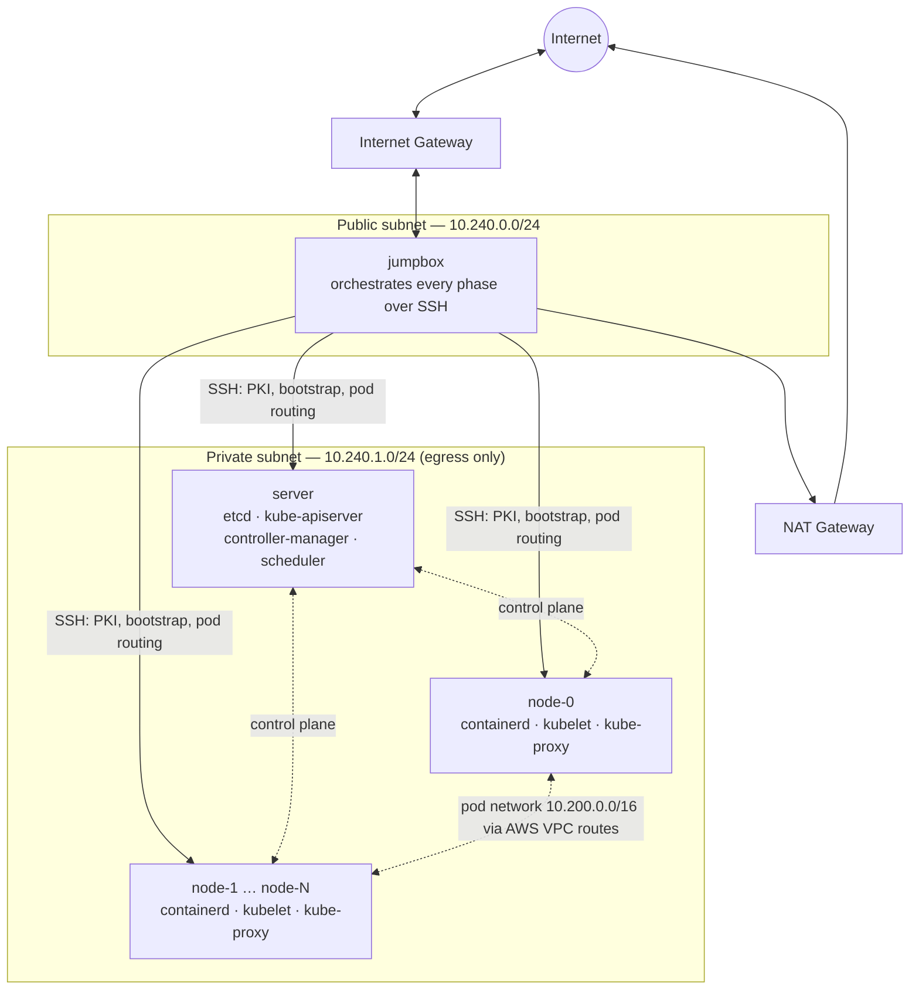

# Kubernetes The Hard Way — Automated on AWS

[](https://www.terraform.io/)
[](https://aws.amazon.com/)
[](https://kubernetes.io/)
[](#lessons-learned--challenges-overcome)

A Kubernetes cluster — control plane, workers, PKI, and pod networking — built from
scratch on AWS with **no `kubeadm`** and **no managed control plane**, brought up entirely
by one `terraform apply`. Five dependent phases run in order and end with two pods, on two
different EC2 instances, pinging each other across a pod network with no hand-assigned
subnet anywhere in it.

Follows [Kelsey Hightower's Kubernetes The Hard Way](https://github.com/kelseyhightower/kubernetes-the-hard-way) —
the tutorial that builds Kubernetes one binary and one certificate at a time so the
mechanics behind a managed control plane stop being a black box. That tutorial is written
to be run by hand; this project automates every step of it, including the one piece
upstream doesn't attempt: dynamic per-node pod-CIDR allocation and routing.

**Applied and verified live on real AWS — `0% packet loss` on a cross-node pod ping is
this project's actual, original success criterion.**

## Architecture



Five dependent phases behind that one `apply`: **infrastructure → PKI → control plane →
worker bootstrap → pod networking**, each gated on the last via `depends_on`. Everything
past the base infrastructure runs as shell scripts over SSH from the jumpbox — no separate
orchestrator process, no Python. Full stage-by-stage dependencies are in the
[Runbook](terraform/RUNBOOK.md#what-terraform-apply-actually-does).

## Tech stack

- **Infrastructure & IaC:** Terraform (5-module design) · AWS (VPC, EC2, IAM, SSM
  Parameter Store, NAT Gateway, Route Tables)
- **Kubernetes, built by hand:** etcd · kube-apiserver · kube-controller-manager ·
  kube-scheduler · kubelet · kube-proxy · containerd · CNI bridge
- **Security / PKI:** OpenSSL, a self-signed x.509 CA, least-privilege IAM,
  KMS-encrypted SSM SecureStrings
- **Orchestration:** Bash, SSH, Terraform provisioners (`null_resource` + `remote-exec`)

## Key features

- **Fully automated 5-phase bootstrap** — infrastructure, PKI, control plane, workers,
  pod networking, one `terraform apply`, zero manual steps.
- **Hand-built control plane** — no `kubeadm`, no managed EKS; etcd, the apiserver,
  controller-manager, and scheduler configured exactly as Kubernetes The Hard Way
  specifies.
- **Custom PKI pipeline** — a self-signed CA, six control-plane certs, and one cert per
  worker, generated, cross-verified, and distributed entirely by script.
- **Dynamic pod-CIDR allocation and AWS-native routing** — `--allocate-node-cidrs` plus a
  script that programs one VPC route per worker; no hand-typed subnet table anywhere.
- **`NodeRestriction`-aware worker identity** — a per-worker `--hostname-override` so
  kubelet's registered name matches its certificate's CN.
- **Self-healing pod routing** — a replaced worker gets `replace-route`d automatically
  instead of leaving a blackhole route behind.
- **Content-hash-triggered idempotency** — a second `apply` against a live cluster is a
  no-op; editing a script forces exactly the right re-run.

## Getting started

**Prerequisites:** Terraform ≥ 1.5, an AWS account with room for 4 `t3.small`/`t3.micro`
instances, and the AWS CLI already configured (`aws sts get-caller-identity` should work).

```bash
git clone https://github.com/MuhammadMarmash/kubernetes-the-hard-way-aws.git
cd kubernetes-the-hard-way-aws/terraform
cp terraform.tfvars.example terraform.tfvars   # narrow ssh_allowed_cidrs, adjust AZ/type if needed
terraform init
terraform apply
```

Expect it to take a while — NAT gateway provisioning, ~700MB of binaries downloaded once
on the jumpbox, multiple SSH hops doing real work. Not a fast `apply`. When it's done:

```bash
terraform output -json cluster | jq
eval "$(terraform output -raw jumpbox_ssh_command)"
```

A NAT gateway bills by the hour whether the cluster is doing anything or not:
`terraform destroy` when you're done. AWS capacity in `eu-north-1` can be tight — see the
[Runbook](terraform/RUNBOOK.md#before-you-apply), or just run `./apply-with-az-retry.sh`.

## Lessons learned / challenges overcome

This cluster came up on the first design, but not on the first apply. Real bugs, found and
fixed against live AWS infrastructure:

- **A race condition in parallel worker bootstrap.** Workers bootstrap concurrently via
  Terraform's `for_each`, which doesn't guarantee sequential execution. Two workers
  bootstrapping at once raced on a shared filename on the jumpbox. Fixed with a unique
  filename per worker.
- **Nodes registering under the wrong identity.** kubelet defaults to the EC2-assigned
  hostname, but its certificate's CN is `system:node:node-N` — and `NodeRestriction`
  admission rejects any mismatch. Fixed with a per-worker `--hostname-override`.
- **A certificate SAN gap that TLS caught but `kubectl get nodes` didn't.** The apiserver
  dials kubelets back by IP for `exec`/`logs`/metrics, TLS-verified against the worker's
  cert. Without an IP SAN, the cluster looked healthy while `kubectl exec` failed
  verification — invisible until you actually use the cluster.
- **A silent ~1-hour retry storm on AWS capacity errors.** The AWS Go SDK defaults to 25
  retries on `InsufficientInstanceCapacity`, configured deep inside the SDK client the
  Terraform provider builds — unreachable from a resource `timeouts` block or an env var.
  Fixed at the one setting that actually controls it: `max_retries` on the provider block.
- **Dynamic pod networking with no hand-assigned subnets.** The one piece of upstream KTHW
  that doesn't survive automation as-is. Replaced its hand-typed subnet table with
  `--allocate-node-cidrs` plus a script that programs AWS VPC routes automatically.

## Full documentation

Verification steps for every phase, a troubleshooting guide, and the complete
phase-by-phase design rationale live in **[terraform/RUNBOOK.md](terraform/RUNBOOK.md)**.
